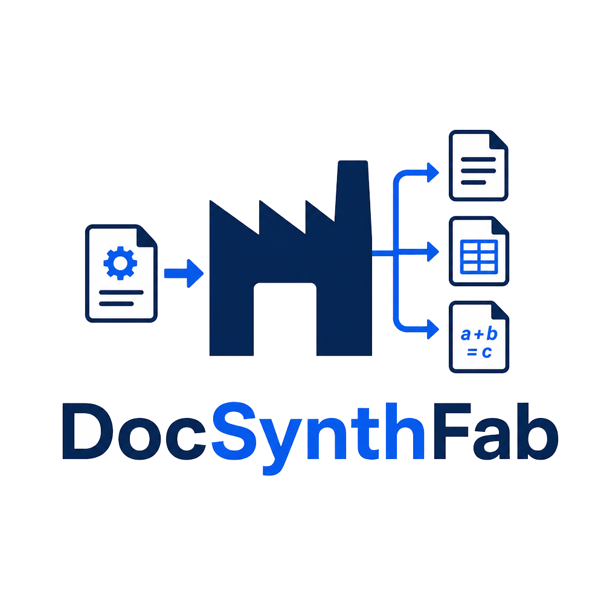

<p align="center">
  
</p>

<h1 align="center">DocSynthFab</h1>

<p align="center">
  One-click synthetic labeled document dataset generation for OCR, layout analysis, segmentation, and Document AI experiments.
</p>

<p align="center">
  <strong>Generate document images, annotations, masks, ground truth files, train/validation/test splits, reports, and export-ready dataset packages.</strong>
</p>

---

## What is DocSynthFab?

DocSynthFab is an open-source synthetic document dataset generator.

It creates document-like page images together with structured labels, annotation JSON files, segmentation masks, ground truth files, train/validation/test splits, reports, and export-ready dataset formats.

The main idea is simple:

> Generate labeled document datasets automatically instead of manually collecting documents and drawing annotations.

DocSynthFab is designed for experiments in:

* OCR
* Document AI
* layout analysis
* text/table detection
* segmentation
* synthetic dataset prototyping
* annotation pipeline testing

---

## Why DocSynthFab?

Labeled document data is expensive and slow to create.

A typical Document AI dataset workflow may require:

* collecting document samples
* checking privacy and copyright risks
* manually drawing bounding boxes
* creating segmentation masks
* preparing train/validation/test splits
* converting annotations into training formats
* validating output quality

DocSynthFab automates a large part of this workflow by generating synthetic labeled document samples directly.

---

## Key Features

* Synthetic document page generation
* Annotation JSON output
* Ground truth text output
* Text/table/math-aware masks
* Train/validation/test split generation
* Dataset reports
* Export-ready dataset package structure
* Text and table-heavy layout support
* Multilingual font support through a Noto-based font pack
* Optional LaTeX/math rendering through a separate Docker renderer
* CLI-first workflow
* Optional NiceGUI-based Web GUI
* End-to-end tests for output package, annotation, mask, and export validation

---

## Output Structure

A generated dataset contains folders similar to:

```text
out/demo/
  images/
  masks/
  ann/
  gt/
  splits/
  reports/
  exports/
```

Typical generated files include:

```text
images/000001.png
ann/000001.json
gt/000001.json
masks/000001_text.png
reports/run_manifest.json
reports/dataset_card.md
reports/label_schema.json
reports/features.csv
splits/train.txt
splits/val.txt
splits/test.txt
```

---

## Installation

Clone the repository:

```bash
git clone https://github.com/EndEgl/DocSynthFab.git
cd DocSynthFab
```

Create and activate a virtual environment:

```bash
python -m venv .venv
```

On Windows PowerShell:

```powershell
.\.venv\Scripts\Activate.ps1
```

On Linux/macOS:

```bash
source .venv/bin/activate
```

Install dependencies:

```bash
pip install -r requirements.txt
```

If the project supports editable installation:

```bash
pip install -e .
```

---

## Quickstart: CLI

Generate a small demo dataset:

```bash
python -m docsynthfab.cli --config configs/default.yaml --out out/demo --pages 5 --workers 1 --seed 123
```

Generate a dataset with export targets:

```bash
python -m docsynthfab.cli --config configs/default.yaml --out out/demo --pages 10 --workers 2 --seed 123 --export native,segformer,coco
```

The output will be written to:

```text
out/demo/
```

---

## Web GUI

DocSynthFab includes an optional NiceGUI-based Web GUI.

Run:

```bash
python -m docsynthfab.gui.web.app
```

The Web GUI provides:

* dataset preset selection
* text/table mix controls
* layout randomness controls
* font setup status
* LaTeX renderer status
* effective YAML preview
* run monitor
* output folder access

---

## LaTeX Renderer

The main generator is text/table-oriented by default.

LaTeX/math-heavy generation is separated into a Docker-based renderer so that LaTeX dependencies remain isolated.

Renderer location:

```text
docker/latex-renderer/
```

Example Docker usage:

```bash
cd docker/latex-renderer
docker build -t docsynthfab-latex-renderer .
docker run --rm -p 8765:8765 docsynthfab-latex-renderer
```

Then use the LaTeX Renderer tab in the Web GUI or enable the related config options.

---

## Fonts

DocSynthFab includes a minimal Noto-based font pack for multilingual synthetic document rendering.

Font manifest:

```text
assets/fonts/FONT_MANIFEST.json
```

Font documentation:

```text
assets/fonts/README_FONT_MANIFEST.md
```

Font license files:

```text
assets/fonts/LICENSES/
```

The bundled fonts are included only as part of the DocSynthFab software package. They are not sold or distributed as a standalone font package.

Generated documents, images, PDFs, and datasets are not required to be licensed under the font license.

See the full font license files under `assets/fonts/LICENSES/`.

---

## Testing

Run syntax checks:

```bash
python -m compileall src
```

Run unit tests:

```bash
pytest test/unit -q
```

Run E2E tests:

```bash
pytest test/e2e -q
```

Some E2E tests may be marked as slow because they generate actual dataset outputs.

---

## Project Status

DocSynthFab is currently an early open-source project.

The current public version focuses on generic multilingual synthetic document dataset generation.

It does not bundle invoice, receipt, contract, or business-specific templates by default. Users may create their own custom region templates if needed.

---

## Intended Use

DocSynthFab is intended for researchers, students, developers, and engineers who need synthetic labeled document data for experimentation.

It can be useful when real documents are difficult to collect because of:

* privacy constraints
* copyright restrictions
* manual annotation cost
* lack of labeled layout data
* need for controlled synthetic variation

---

## Limitations

DocSynthFab generates synthetic data.

Synthetic data is useful for prototyping, pretraining, testing, and controlled experiments, but it may not fully represent real-world document distributions.

For production-grade model training, synthetic data should usually be combined with carefully validated real-world samples.

---

## Roadmap

Possible future improvements:

* More document layout templates
* Better table diversity
* More export formats
* Larger multilingual content banks
* Better visual degradation simulation
* Improved browser-based preview
* Optional benchmark datasets
* More automated quality reports

---

## License

DocSynthFab is licensed under the Apache License 2.0.

See [LICENSE](LICENSE) for the full license text.

Additional attribution and third-party component information is available in [NOTICE](NOTICE).

Bundled fonts, Python dependencies, Docker images, system packages, LaTeX distributions, TeX packages, and Docker base images remain under their own respective licenses.

Font-specific license information is available under:

- `assets/fonts/LICENSES/`
- `assets/fonts/FONT_MANIFEST.json`
- `assets/fonts/README_FONT_MANIFEST.md`


---

## Maintainer

Maintained by [EndEgl](https://github.com/EndEgl).

---

## Short Description

DocSynthFab generates synthetic document images with labels, masks, annotations, ground truth files, splits, reports, and export-ready dataset formats for OCR and Document AI experiments.


