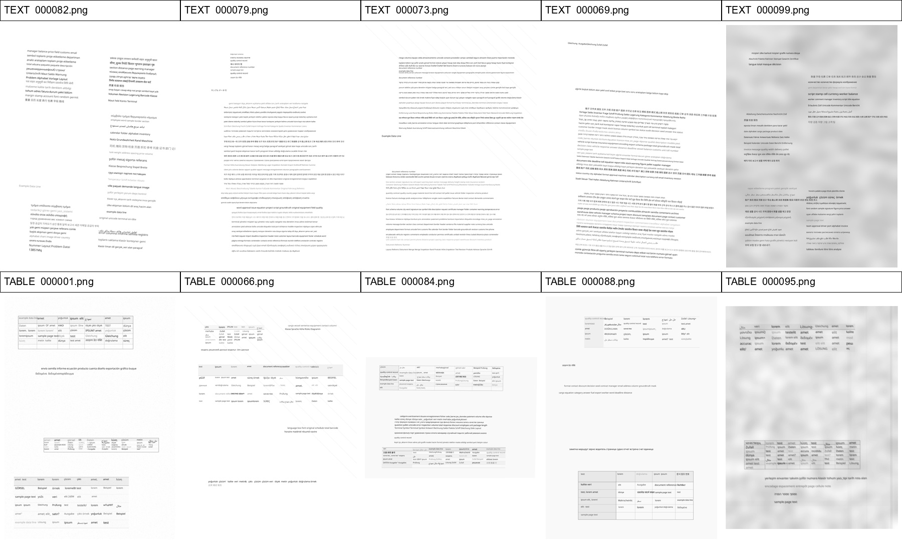

# DocSynthFab Sample Outputs

This folder contains a curated early-alpha sample package generated by DocSynthFab.

It includes ten selected multilingual document pages:

- Five text-heavy examples.
- Five table-heavy examples.

The preview image below shows all selected pages together:

## Folder Structure

- `text_heavy/` contains selected text-heavy pages and related artifacts.
- `table_heavy/` contains selected table-heavy pages and related artifacts.

Each group may include:

- `images/` — generated page images.
- `ann/` — annotation JSON files.
- `gt/` — ground-truth JSON files.
- `masks/` — generated binary masks.
- `mask_overlays/` — visual overlays of masks on top of the generated page images.
- `exports/` — selected Native, COCO, and SegFormer-style export artifacts.

## Notes

These are visual and structural examples only. They are not benchmark results.

COCO annotations in this sample package are filtered to the selected sample IDs where available.

The SegFormer-style export currently uses image folders with split binary masks for text and math regions.
